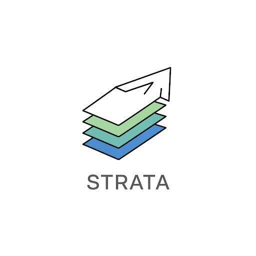



# Strata

Strata offers a unified platform for formalizing language syntax and
semantics, and implementing automated reasoning applications. Strata
provides a family of intermediate representations via _dialects_ that
model specific programming constructs, and is extensible by tool
developers to customize additional features to their needs.

This README will help you get started with using and extending
Strata. Also see the [Architecture](docs/Architecture.md) document
that introduces some terminology and describes Strata's components,
and a [Getting Started](docs/GettingStarted.md) guide that describes
how to create a new dialect and analysis using existing features.

**N.B.: Strata is under active development, and there may be breaking
changes!**

## Prerequisites

1. **Lean4**: Strata is built on Lean4; see the build specified in the
   `lean-toolchain` file.

   You can install Lean4 by following the instructions [here](https://lean-lang.org/).

2. **SMT Solver**: Analysis tools in Strata use SMT solvers for program
   verification.
   - Install an SMT solver. You can use any solver you want, but the unit
     tests assume `cvc5` is on your `PATH` [cvc5](https://cvc5.github.io/).

## Build

Build and test the code in Lean's standard way:

```bash
lake build && lake test
```

Unit tests are run with `#guard_msgs` commands. No output means the tests passed.

To build executable files only and omit proof checks that might take a long time, use

```bash
lake build strata:exe StrataVerify StrataToCBMC StrataCoreToGoto
```

## Running Analyses on Existing Strata Programs

Strata programs use the `.st` file extension, preceded by the dialect name,
preceded by a second `.` e.g., `SimpleProc.core.st` or
`LoopSimple.csimp.st`. Note the current `StrataVerify` executable
relies on this file extension convention to know what dialect it's
parsing (since the Strata IR allows a program to open multiple
dialects).

Here is an example invocation that runs Strata's deductive verifier.

```bash
lake exe StrataVerify Examples/SimpleProc.core.st
```

This will:
1. Parse, type-check, and generate verification conditions (VCs) via
   symbolic evaluation.
2. Use an SMT solver to discharge the VCs.
3. Report the results.

Currently, each VC that is not proved by symbolic simulation alone is
printed out in Strata's internal format (more accurately, in the
internal format of the dialects used to implement the language under
analysis). These VCs are then encoded into SMT, and counterexamples,
if any, report models for the variables present in the problem.

## Troubleshooter

### When running unit tests: "error: no such file or directory (error code: 2)"

This is likely due to `cvc5` or `z3` not being in the PATH environment variable. Add them and try again.

## License

The contents of this repository are licensed under the terms of either
the Apache-2.0 or MIT license, at your choice. See
[LICENSE-APACHE](LICENSE-APACHE) and [LICENSE-MIT](LICENSE-MIT) for
details of the two licenses.

